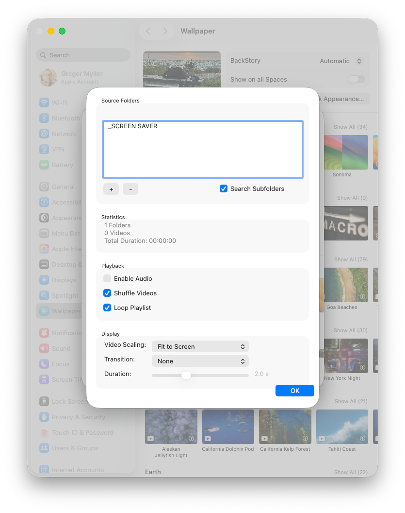

# Video Screen Saver

A macOS screen saver that plays videos from your selected folders with smooth transitions and customizable playback options.



## Features

- **Multiple Video Folders** - Add multiple source folders for your video collection
- **Recursive Scanning** - Optionally scan subfolders for videos
- **Shuffle & Loop** - Randomize playback order and loop continuously
- **Video Scaling** - Fill, fit, or stretch to match your display
- **Smooth Transitions** - Fade or cross-dissolve between videos
- **Audio Control** - Enable or disable video audio
- **Real-time Statistics** - View folder count, video count, and total duration

## Requirements

- **macOS 15.0** (Sequoia) or later
- Intel or Apple Silicon Mac

## Installation

### Download Release

1. Download `Video Screen Saver.saver` from the [Releases](https://github.com/Xpycode/VideoScreenSaver/releases) page
2. Double-click the downloaded file
3. Choose to install for **This User Only** or **All Users**
4. Open **System Settings** → **Screen Saver**
5. Select **Video Screen Saver**
6. Click **Options...** to configure

### Build from Source

```bash
# Clone the repository
git clone https://github.com/Xpycode/VideoScreenSaver.git
cd VideoScreenSaver

# Build with Xcode
xcodebuild -project "01_Project/Video Screen Saver.xcodeproj" \
           -scheme "Video Screen Saver" \
           -configuration Release \
           build

# Find the built .saver file
open ~/Library/Developer/Xcode/DerivedData/Video_Screen_Saver-*/Build/Products/Release/
```

## Configuration

### Source Folders
Click **+** to add folders containing video files. The screen saver supports all QuickTime-compatible formats (MP4, MOV, M4V, etc.).

Enable **Search Subfolders** to recursively scan for videos in nested directories.

### Playback Options
| Option | Description |
|--------|-------------|
| Enable Audio | Play video audio (off by default) |
| Shuffle Videos | Randomize playback order |
| Loop Playlist | Restart from beginning when all videos finish |

### Display Settings
| Setting | Options |
|---------|---------|
| Video Scaling | **Fill Screen** (crop to fill), **Fit to Screen** (letterbox), **Stretch** |
| Transition | **None**, **Fade**, **Cross Dissolve** |
| Duration | Transition length: 0.5 - 5.0 seconds |

## Folder Permissions

macOS sandboxing requires explicit permission to access your video folders:

1. When adding a folder, grant access when prompted
2. If videos don't play, check **System Settings** → **Privacy & Security** → **Files and Folders**

## Uninstallation

```bash
# For current user
rm -rf ~/Library/Screen\ Savers/Video\ Screen\ Saver.saver

# For all users (requires admin)
sudo rm -rf /Library/Screen\ Savers/Video\ Screen\ Saver.saver
```

## Troubleshooting

**Screen saver not appearing?**
- Ensure it's selected in System Settings → Screen Saver
- Try restarting System Settings

**No videos playing?**
- Verify folders are added and contain supported video files
- Check folder permissions in Privacy & Security settings
- Enable "Search Subfolders" if videos are in nested directories

**Black screen or transition issues?**
- Ensure video files aren't corrupted (test with QuickTime Player)
- Try disabling transitions temporarily

## License

MIT License - See [LICENSE](LICENSE) for details.

## Credits

Developed by [Xpycode](https://github.com/Xpycode)
